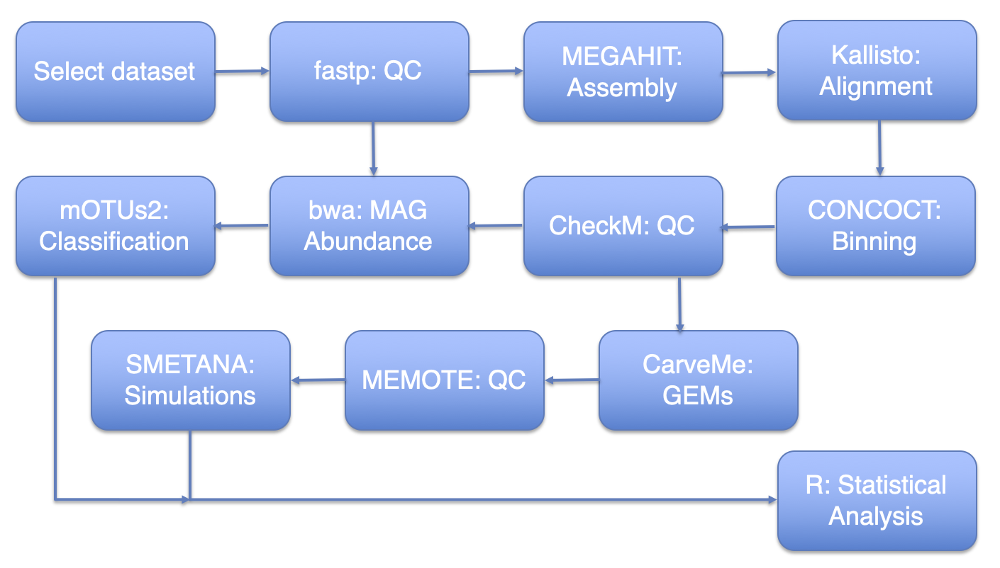
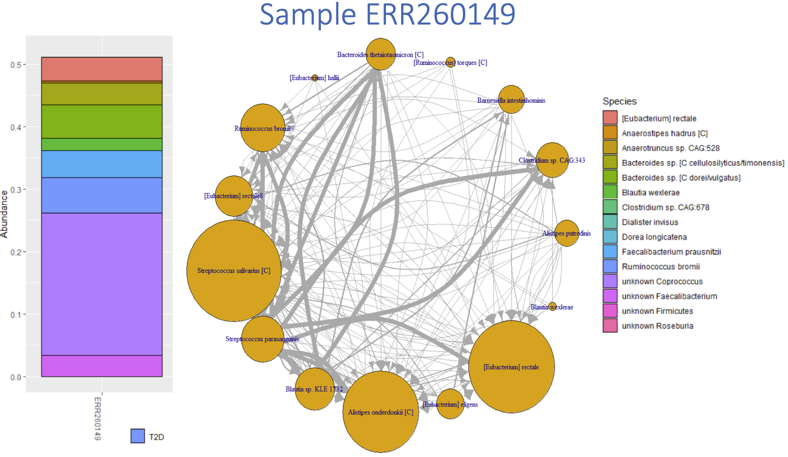

## metaBAGpipes: metaBolism And metaGenomic analysis pipelines

### Use cases

1. Paired end read QC using fastp
2. Assembly 
      * using metaSPAdes (better assemblies)
      * using megahit (better performance)
3. Binning
      * using metabat2 (less steps, lower quality results)
      * using CONCOCT (more steps, high quality results)
        1. cut large contigs into 10 kb chunks
        2. cross map all samples using kallisto quant
        3. summarize coverage results into concoct input tables
        4. run CONCOCT
        5. merge clustering results to get original uncut contigs
        6. extract bins
4. MAG QC using CheckM
5. MAG abundance
   * using mOTUs2
   * based on mapping using bwa
6. MAG classification using mOTUs2 classifier
7. MAG growth rate estimates using GRiD
8. GEM reconstruction using CarveMe
9. GEM QC using memote
10. GEM community simulations using SMETANA

### Abstract
metaBAGpipes integrates an array of existing bioinformatics and metabolic modeling tools using Snakemake, for the purpose of interrogating social interactions in bacterial communities of the human gut microbiome. From WGS metagenomic datasets, metagenome assembled genomes (MAGs) are reconstructed, which are then converted into genome-scale metabolic models (GEMs) for *in silico* simulations of cross feeding interactions within sample based communities. Abundance estimates for community members are estimated by mapping metagenomic samples to the generated MAGs, which are used in combination with the simulated cross feeding interactions for the generation of explanatory and statistically significant linear models. We conclude that there is indeed a correlation, ranging from weak to moderate, between gut microbiome members’ abundance and set of metabolic cross-feeding interactions across samples. A more comprehensive analysis incorporating multiple datasets needs to be conducted to strengthen and expand the findings of this work.

# 

### Significance

To our best knowledge, the work presented in this thesis project represents the first application of sample-specific gut microbiome community FBA simulations using MAG-based GEMs. While there are limitations to this approach, as discussed in the thesis write-up, it is conceivable that a fine-tuned version of such a pipeline could be used to study, develop, and evualuate personalized medicine treatments. 137 WGS gut metagenome samples were processed in this study, a relatively modest amount of data. By analyzing a greater number of samples, further machine learning methods can be employed to interrogate the network architechture of microbial communities and facilitiate data driven hypothesis generation. The figure below is a visual representation of the output information one can obtain from a particular sample using metaBAGpipes.

# 

Dataset used:
  * Karlsson, Fredrik H., et al. “Gut Metagenome in European Women with Normal, Impaired and Diabetic Glucose Control.” *Nature*, vol.498, no.7452, 2013, pp.99–103. , doi:10.1038/nature12198.

This repository is administered by Francisco Zorrilla ([@franciscozorrilla](https://github.com/franciscozorrilla/)), Structural and Computational Biology Unit, EMBL. metaBAGpipes was developed throughout my Master's thesis project at the Systems and Synthetic Biology division of Chalmers Univeristy of Technology, under the supervision of Aleksej Zelezniak.

  * Last update: 24-09-2019
